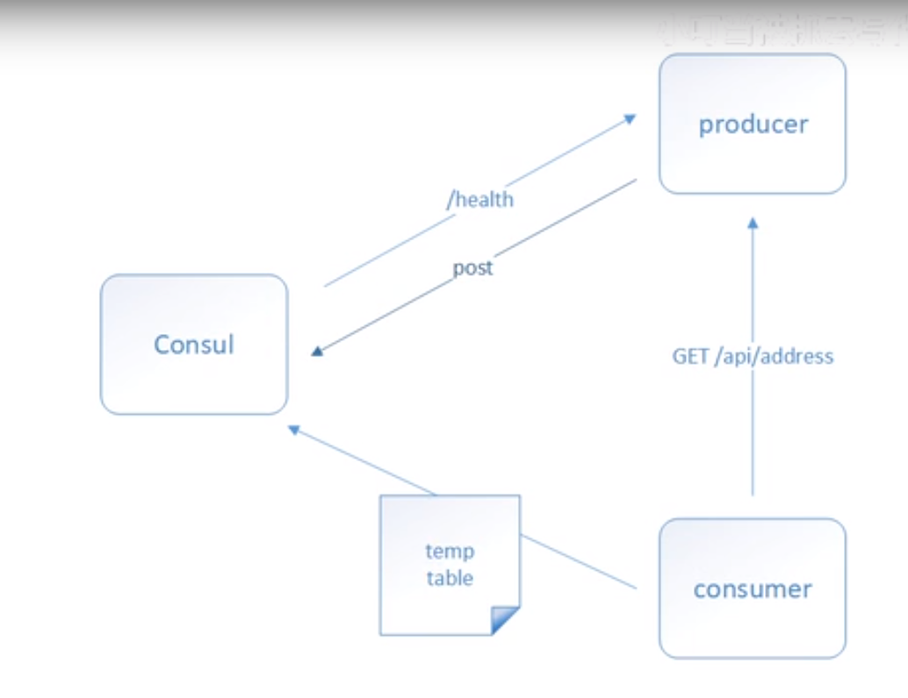

### consul使用教程
#### 安装   
1. [下载地址](https://www.consul.io/downloads) ,下载后是一个.exe文件
2. 将.exe的路径配置为环境变量
3. 输入consul --version即可以看consul版本了
#### 简单介绍
1. consul有三种模式
    + server 服务端模式，该模式会持久化，用于集群
    + client 该模式不会持久化，用于集群，类似于代理 
    + dev 该模式为单机模式，用于开发
    + 启动命令 consul agent -[模式] [-client=ip]
    + 启动后就可以看localhost:8500的ui界面
    + 集群部署时建议3或5个服务器，(为什么不是4，因为默认集群服务少于1半后集群不可用了，所以最好为基数)
2. consul请求模型如下 
#### 入门案例
##### 服务提供者  
+ 项目
    + 必须是完整的webapi
    + 提供健康检查接口，一般是api/Health,“get”
+ 配置文件
    + 配置端口
    + 配置注册服务
    + 配置服务名称
    + 配置服务唯一id
    + 注册中心ip+port
    + 服务请求ip+port

##### 服务消费者
    + 配置不注册服务
    + 配置注册中心ip+port
    + 在程序里使用url 为{服务名}/uri
    + 服务ip+port